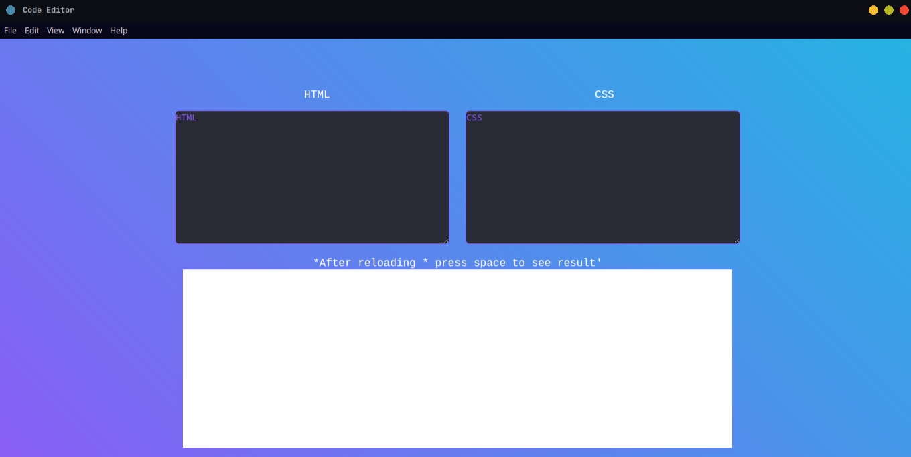

<h1> Code Editor made using Electron for HTML and CSS</h1>
Welcome to CodeEditor, a lightweight and versatile code editor built using Electron. With this editor, you can seamlessly edit HTML, JavaScript, and CSS files, providing you with a powerful environment for web development

 #node modules have been ignored so ,
git clone https://github.com/ukesh-dhakal/Code-editor-app-electron/
 cd code-editor-app-electron
 npm start

